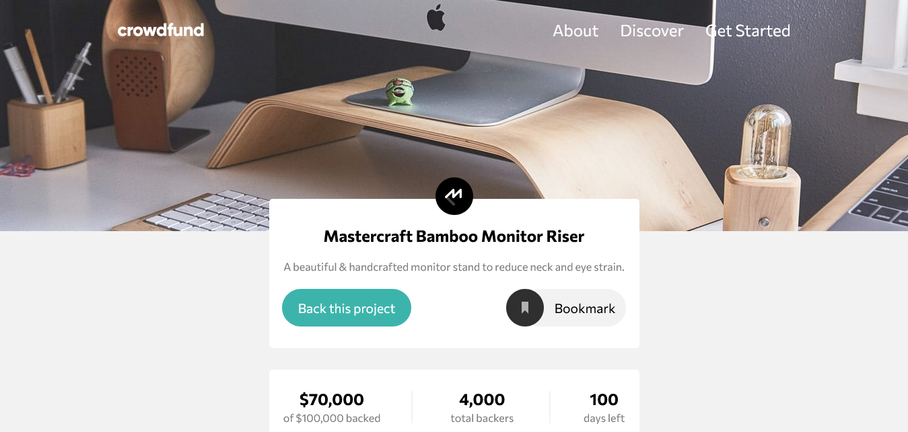

# Frontend Mentor - Crowdfunding product page solution

This is a solution to the [Crowdfunding product page challenge on Frontend Mentor](https://www.frontendmentor.io/challenges/crowdfunding-product-page-7uvcZe7ZR).  

## Table of contents

- [The challenge](#the-challenge)
- [Screenshot](#screenshot)
- [Links](#links)
- [Built with](#built-with)
- [What I learned](#what-i-learned)
- [Continued development](#continued-development)
- [Useful resources](#useful-resources)
- [Author](#author)

### The challenge

Users should be able to:

- View the optimal layout depending on their device's screen size
- See hover states for interactive elements
- Make a selection of which pledge to make
- See an updated progress bar and total money raised based on their pledge total after confirming a pledge
- See the number of total backers increment by one after confirming a pledge
- Toggle whether or not the product is bookmarked

### Screenshot

### Links

- Solution URL: [Github](https://github.com/sangodare/crowdfunding-product-page)
- Live Site URL: [Netlify link](https://crowdfundingprdpagebytoyeeb.netlify.app/)

### Built with HTML CSS and JavaScript

The solution to the challenge was built with HTML, CSS and JavaScript. I made sure the solution i built is a close match  to the design provided by Frontend Mentor. I made use of semantic HTML5 markup such as nav, button, header, section and so on. flexbox and CSS GRID came in handy for the layout. An additonal feature was added, the data on the progress made is stored in the local storage so that when a user reloads or revisits the page, any update to the progress made will take into account the data from the previous page visits. 

### What I learned

I learnt how to create accessible mobile menu using the appropriate aria-labels such as aria-controls and aria-expanded, assign roles to elements e.g the element that controls the menu has role 'button' while the element that contains the menu has role 'menu'.

Also learnt about positoning elements in CSS, how it affects the layout e.g using 'position: absolute' on a transformed element can cause overflow which can lead to horizontal scrolling.

Also learnt that background images in CSS are not accessible.

Moving forward, accessibility will be at the forefront of any project i build, my goal is to use more semantic HTML and  learn more about accessibility, so as to ensure anything i build is accessible.

## Author

Connect with me on Twitter [@Iamtoyeeb](https://www.twitter.com/Iamtoyeeb).

